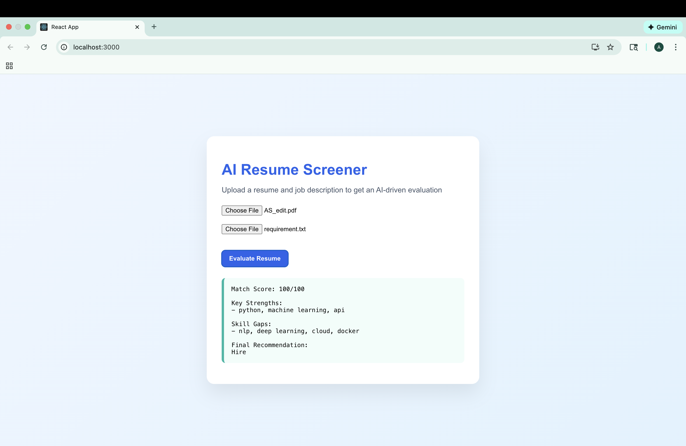

# AI-Powered Resume Screening & Job Matching System

An end-to-end AI-driven application that automatically evaluates resumes against job descriptions using semantic similarity, NLP, and vector search. The system helps recruiters and candidates quickly assess job fit with structured, explainable results.


## 🚀 Features

- Upload resume (PDF) and job description (TXT)
- Semantic matching using embeddings and vector similarity
- AI-based evaluation with match score, strengths, skill gaps, and recommendation
- Clean, responsive React frontend
- Production-style FastAPI backend


## 🛠 Tech Stack

### Backend
- Python
- FastAPI
- LangChain
- HuggingFace Embeddings
- FAISS (Vector Database)
- NLP

### Frontend
- React.js
- Axios
- Modern UI with blue/teal theme


## 🧠 How It Works

1. Resume PDF is parsed and chunked
2. Text embeddings are generated using HuggingFace models
3. FAISS vector store performs semantic similarity search
4. Relevant resume sections are compared against the job description
5. An AI-based evaluator produces:
   - Match Score
   - Key Strengths
   - Skill Gaps
   - Final Recommendation


## 📊 Sample Output

- **Match Score:** 100/100  
- **Key Strengths:** Python, Machine Learning, APIs  
- **Skill Gaps:** NLP, Cloud, Deep Learning  
- **Recommendation:** Hire  
## 📸 Application Screenshot




## 🖥 Running the Project Locally

### Backend & Frontend
Backend

```bash
python -m venv venv
source venv/bin/activate
pip install -r requirements.txt
uvicorn api.main:app --reload
Backend runs at: http://127.0.0.1:8000

Frontend

cd ai-resume-ui
npm install
npm start
Frontend runs at: http://localhost:3000
